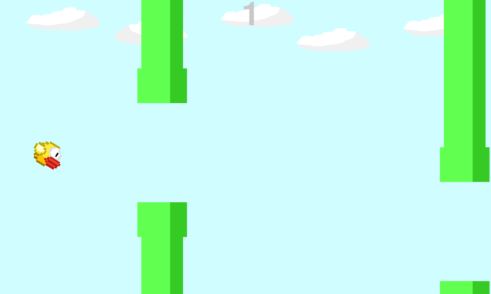
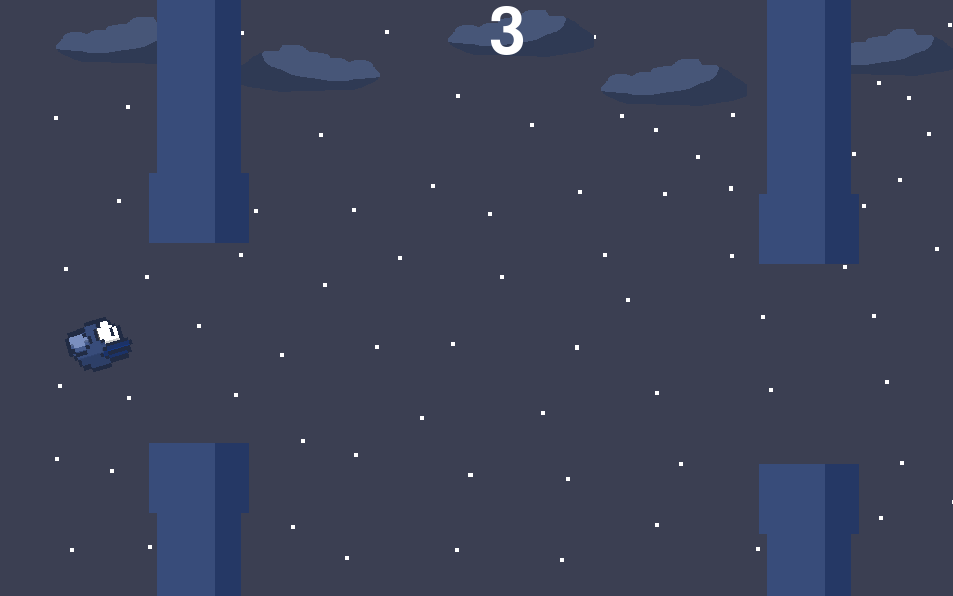

# flappy-bird-python
A simple Flappy Bird remake for learning Python game development with Pygame!

## Mechanics and things i learned:

- **Gravity**

- **Random library**

- **Creating new commands using ***def*****

- **Fixing and diagnosing code**

## How to run

**make sure you have ***PYTHON*** and ***PYGAME*** installed**

if not install ***python*** from the official website

https://www.python.org/downloads

or install ***pygame*** using terminal

`pip install pygame`

then either download the game from the releases and run **"flappy-bird.py"**

or

open terminal and type in

`git clone https://github.com/VxidDev/flappy-bird-game.git`

`cd flappy-bird-game`

and finally run game by typing

`python flappy-bird.py`

# ***ENJOY THE GAME!***
